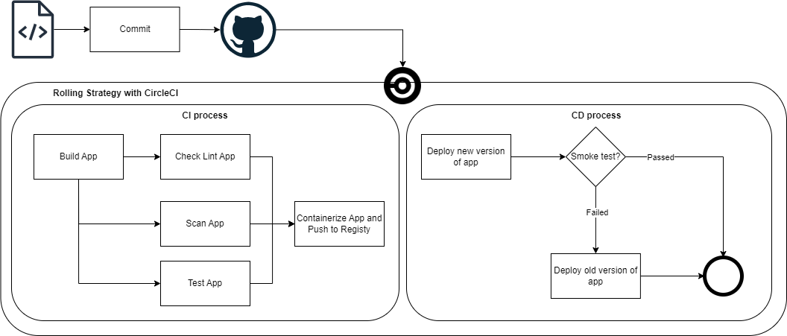

# Udacity - Cloud DevOps Engineer - Capstone

## Project propose
Use AWS with CloudFormation, KES for infrastructure
Use CircleCI for CICD Pipeline

Here is a CICD Pipeline propose diagram

## Prerequisites
You must install docker and k8s in local
## How to run
### Local
Build docker image:
> ./scripts/build-image.sh

Deploy to local cluster
> kubectl apply -f k8s/local

Forwarding port to localhost:8080
> kubectl port-forward service/uda-app-service 8080:80

### AWS
For AWS CICD pipeline with CircleCI we will need setup infrastructure first:
1. Create network infrastructure
> ./scripts/deploy-network.sh create 
1. Create cluster infrastructure (EKS)
> ./scripts/deploy-cluster.sh create 

## Project preview
You can see my project quick view [here](./docs/PROJECT_QUICKVIEW.md)

## App source reference
I get initial source for app from https://github.com/Yvad60/blog-code-references/tree/setup-jest-and-react-testing-library
